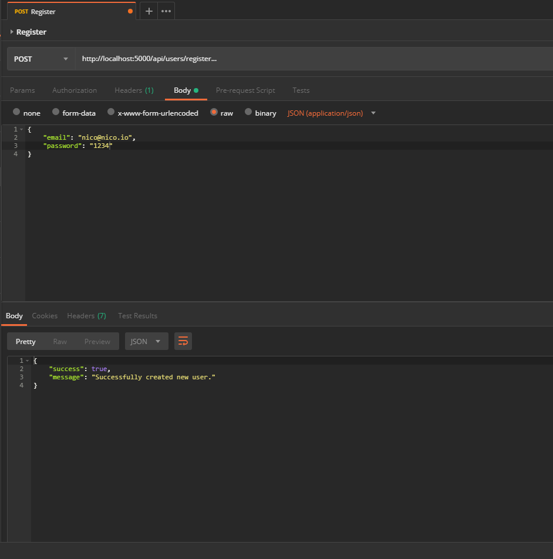
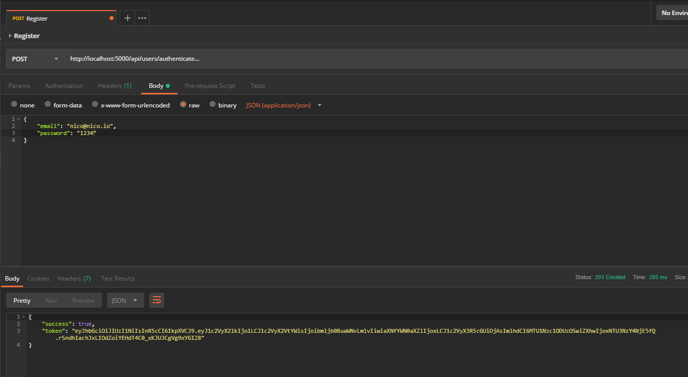
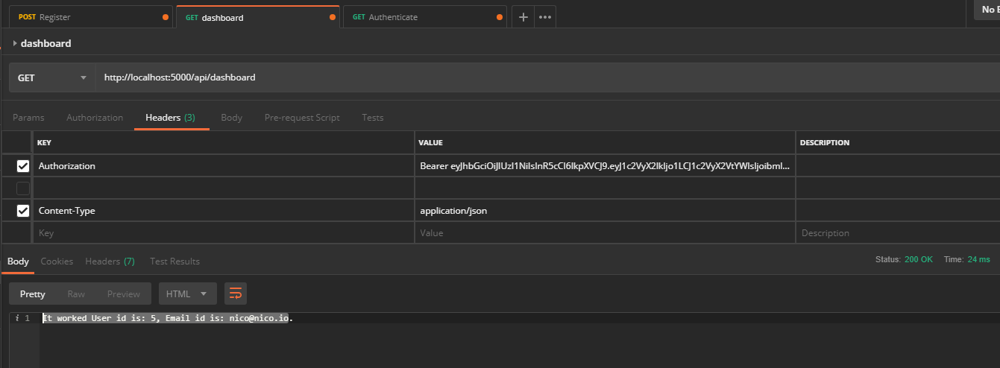
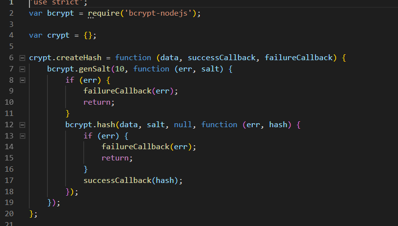

# Passport-jwt-mysql with express

It's a back-end application with an admin and classic register/logging.

## Project initialization
 ```
 Git clone https://github.com/qdanneville/passport-jwt-mysql
 
 cd passport-jwt-mysql

 npm install

 npm run start-dev
 ```

 * In the **config** folder, replace the database informations (host, user, password, name) in the **main.js** file.
 * In the **dbScript** folder, copy the code in the **passport-auth.sql** file, and paste it into sql request in phpMyAdmin.

## Dependencies
* **bcrypt-nodejs**: A library that helps to hash password.
* **body-parser**: Parse incoming request bodies in a middleware before your handlers, available under the req.body property.
* **cors**: It is a node.js package for providing a Connect/Express middleware that can be used to enable CORS with various options.
* **express**: Node.js framework that allows to create web application.
* **jsonwebtoken**: Generate, decode, and validate tokens.
* **morgan**: HTTP request logger middleware for node.js.
* **mysql**: Mysql driver for Node.js
* **passport**: It is an Express-compatible authentication middleware
* **passport-jwt**: A Passport strategy for authenticating with a JSON Web Token.

## Features
* Register
* Login
* Admin login
* Password hashing

## How it works
* Register
Use Postman to make a **POST** request on **http://localhost:5000/api/users/register**, and use a Json object with email adress and password as request body. If the request is successful, the server return you a boolean "success" at true and a message.



* Login
Use Postman to make a **GET** request on **http://localhost:5000/api/users/authenticate**, and use a Json object with your email and your passport as request body. The app checks if the email exits in the database, and check the entered password with the hashed password. If the two conditions are met, the server return a boolean "success" at true,and generate a token.



* Admin login
Use Postman to make a **GET** request on **http://localhost:5000/api/dashboard**, and create a request header with the key **Authorization** and the value **Bearer + your login token**. If it's successful, the server return you this message: "It worked User id is: ..., Email id is: nico@..."



* Password hashing
The password is firstly salted with the **bcrypt** method **genSalt**. Then the salted password is hashed with the **bcrypt** method **hash**.




## Details
### Author
Vamshi Adi, Nicolas Jouenne(readme).

### Licence
ISC

### Version
1.0.0
